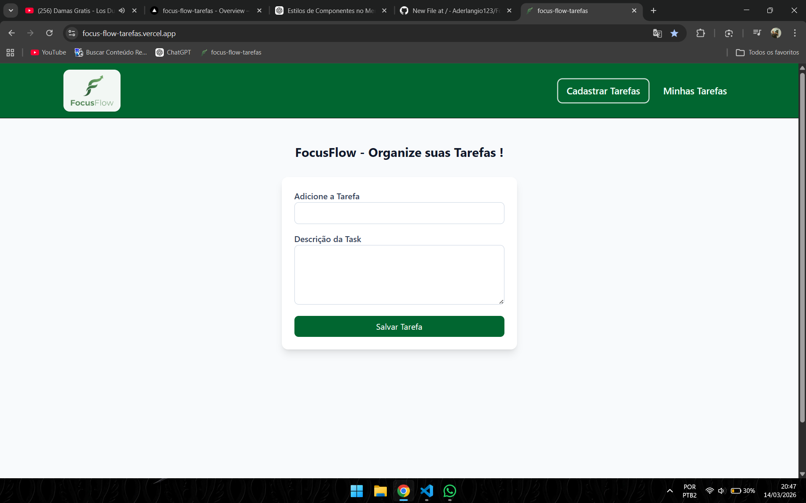
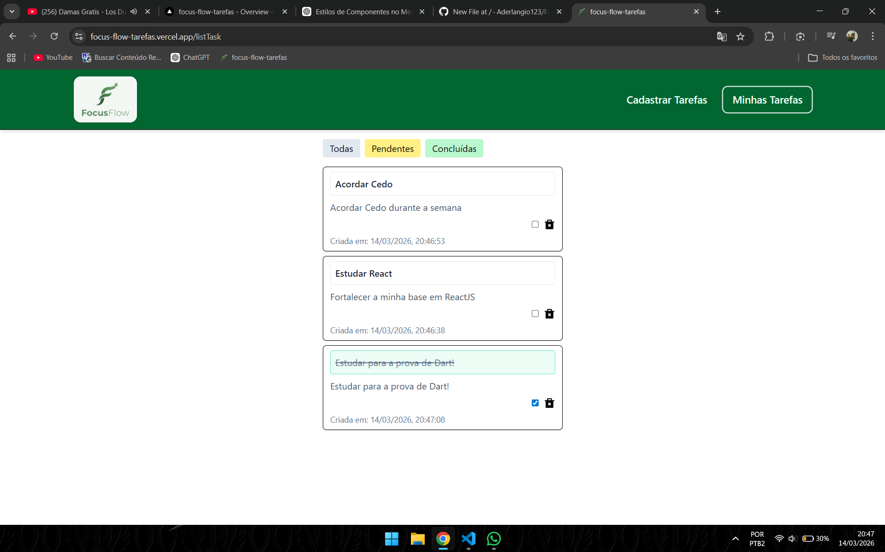

# FocusFlow

Aplicação de gerenciamento de tarefas construída com **React** e **TypeScript**.

## 🚀 Demo

Acesse o projeto online:

https://focus-flow-tarefas.vercel.app/

---

## 🛠 Tecnologias

- React
- TypeScript
- Context API
- Custom Hooks
- CSS
- LocalStorage

---

## ✨ Funcionalidades

- Criar tarefas
- Marcar tarefas como concluídas
- Excluir tarefas
- Filtrar tarefas (Todas / Pendentes / Concluídas)
- Persistência no navegador com **LocalStorage**

---

## 📂 Arquitetura

O projeto utiliza uma estrutura modular para melhor organização do código.

src
├ components
├ context
├ hooks
├ pages
└ types

- **Context API** para gerenciamento de estado global
- **Custom Hooks** para separação da lógica
- **TypeScript** para maior segurança e escalabilidade

---

## 📦 Como rodar o projeto

Clone o repositório:

git clone https://github.com/seuusuario/focusflow.git

Entre na pasta:

cd focusflow

Instale as dependências:

npm install

Rode o projeto:

npm run dev

---

## 📌 Objetivo

Este projeto foi desenvolvido como parte do meu aprendizado em **React + TypeScript**, focando em:

- Arquitetura de aplicações frontend
- Gerenciamento de estado com Context API
- Criação de Custom Hooks
- Boas práticas de componentização

---

## 👨‍💻 Autor

Desenvolvido por **Francisco Aderlangio**
